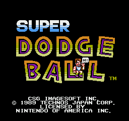

# Super Dodgeball NES — Recompilation *(early WIP)*

Recompile **Super Dodge Ball (USA)** (NES, 1989, Technos Japan) to native C using the [NESRecomp](https://github.com/mstan/nesrecomp) framework and run it on PC.



> **Status:** super early WIP — it boots to a ~99.8% title screen and stumbles through a few menus (mode/skill/team-select) with music mostly correct, and that's the whole show so far. Past team confirm the court BG stalls as tile-soup; gameplay isn't there yet. See `docs/plan.md` for the frontier.

> *Built with [NESRecomp](https://github.com/mstan/nesrecomp) by Matthew Stanley — framework questions belong upstream, game-specific issues belong here. This port is in development — expect rough edges.*

---

## Quick Start

```bash
# Full setup (venv, submodules, MesenCE, runner, blargg test ROMs)
./setup.sh

# Or build and run in one go
./build_and_run.sh

# Rebuild game
cmake -S src -B build -G Ninja -DCMAKE_BUILD_TYPE=Release
cmake --build build -j$(nproc)

# Run with smoke test (100 frames, hash each)
./build/super_dodgeball "roms/Super Dodge Ball (USA).nes" --smoke 100 --smoke-interval 10

# Run interactively
./build/super_dodgeball "roms/Super Dodge Ball (USA).nes"

# Save screenshots for comparison
./build/super_dodgeball "rom.nes" --smoke 100 --save-screenshot recomp_output
```

## Getting MesenCE (for frame comparison)

The recompiled game's frame output can be compared against an accurate NES emulator reference. **MesenCE** (`nesdev-org/MesenCE`) is used as the reference renderer. Three ways to get it:

### Option A: Download pre-built binary (easiest)

```bash
wget -O /tmp/mesen.zip https://github.com/nesdev-org/MesenCE/releases/download/2.2.1/Mesen_2.2.1_Linux_x64.zip
unzip /tmp/mesen.zip -d /tmp/mesen_extract
cp /tmp/mesen_extract/Mesen external/mesence/Mesen
```

Fastest way to get a working Mesen binary. No build tools or .NET SDK required.

### Option B: Build from source

```bash
# Prerequisites: g++/clang++, SDL2 dev, make, .NET SDK
cd external/mesence
USE_GCC=true make -j$(nproc)
```

`setup.sh` does this automatically if the binary doesn't already exist.

**Dependencies:** C++17 compiler, SDL2 development headers, make, and a .NET SDK (8.0 available from apt; 10.0 requires `ppa:dotnet/backports`).

### Option C: Let setup.sh handle it

```bash
./setup.sh
```

Clones `external/mesence` from GitHub, builds with `USE_GCC=true make -j$(nproc)`, and copies the binary to `external/mesence/Mesen`. If the binary already exists, it skips the build.

## Controls

| NES Button | Keyboard | Gamepad 1 |
|---|---|---|
| A | Z | a |
| B | X | y |
| Select | \ | back |
| Start | Return | start |
| Up | Up | d-pad Up |
| Down | Down | d-pad Down |
| Left | Left | d-pad Left |
| Right | Right | d-pad Right |

## Architecture

Static recompilation, not an emulator. The original 6502 machine code is translated to C at build time, then compiled to native code via the runner library.

- **`src/game.toml`** — NESRecomp config (MMC1 mapper, `bank_switch = [0xFF08]`, minimal `fixed` list, dis65-verified `extra_func` entries in banks 0/1/6, two `[[replace_func]]` (`$FCA0`, `$8393_b6`))
- **`src/extras.c`** — Game hooks (`game_on_init`, gated `game_run_nmi` with nested policy/pacing, `setjmp` tunnel landing in `game_run_main`, `game_post_nmi`, `game_on_frame`) plus the `$FCA0`/`$8393_b6` replacements
- **`generated/`** — Auto-generated C code (gitignored). `_full.c` includes all bank parts; `_dispatch.c` has the `call_by_address` dispatch table
- **`external/nesrecomp/`** — NESRecomp framework submodule (recompiler + runner)
- **`external/mesence/`** — MesenCE emulator source (for reference rendering)
- **`tools/frame_gen/`** — Mesen frame export Lua script + wrapper
- **`tools/blargg/`** — blargg test-ROM engine suite (`run_blargg.py`, `manifest.json`, patch-neutral `blargg_extras.c`, `selftest/` canary); per-test builds in `build-blargg/`, ROMs in `external/nes-test-roms/` (both gitignored)
- **`tools/tas/`** — TAS-integrated differential harness: bk2/fm2 → canonical `tas.json`, shared-input runners for MesenCE + recomp with full state capture, three-layer first-divergence diff (`run_tas.py`, `diff_tas.py`, `mesen_tas.lua`); vectors in `tas/vectors/`, runs in `tas/runs/` (gitignored)
- **`patches/`** — Active runner patches, carried as `*.patch` files auto-applied by `setup.sh` to the submodule working tree (`002` RAM-trampoline guard, `003` ROM-miss pop guard, `004` NMI-tunnel unwind, `005` hang-watchdog default) + `archived/` dormant (see `patches/active-patches.md`)

### Project Structure

```
Super Dodgeball Recomp/
├── roms/                          # NES ROM files (gitignored)
├── src/                           # Project source
│   ├── game.toml                  # NESRecomp configuration
│   ├── extras.c                   # Game hooks and overrides
│   ├── CMakeLists.txt             # Build configuration
│   └── third_party/               # Local gitignored build scratch (not shipped)
├── external/nesrecomp/            # NESRecomp submodule
├── external/mesence/              # MesenCE emulator source
├── external/nes-test-roms/        # blargg suite checkout (gitignored, via setup.sh --fetch path)
├── patches/                       # Local runner patches (committed in-submodule + .patch files for setup.sh)
├── build-blargg/                  # blargg per-test builds (gitignored)
├── tools/
│   ├── compare_frames.py          # Mesen reference vs recomp frame comparison
│   ├── rom_to_asm.py              # ROM → assembly listing helper
│   ├── run_roundtrip.py           # ROM → asm → ROM byte-preservation check
│   ├── dis65.py                   # Dependency-free 6502 disassembler
│   ├── blargg/                    # Engine test-ROM suite (run_blargg.py, manifest, extras, selftest)
│   ├── tas/                       # TAS differential harness (converters, runners, diff)
│   ├── frame_gen/                 # Mesen frame export + oracle dump + memwatch scripts
│   └── input/                     # Headless input drivers (title → team-select)
├── tas/
│   ├── vectors/                   # TAS movies (.bk2 + format samples, committed)
│   └── runs/                      # Per-TAS run artifacts (gitignored)
├── generated/                     # Auto-generated C code (gitignored)
├── build/                         # Build output (gitignored)
├── venv/                          # Python virtual environment (gitignored)
├── docs/
│   ├── research.md                # Deep research notes
│   ├── plan.md                    # Project plan
│   ├── pre_publish_audit.md       # Git-history publish audit + remediation record
│   └── assets/                    # README images (title screen)
├── LICENSE.md                   # PolyForm Noncommercial 1.0.0
├── NOTICE.md                      # Attribution + no-ROM disclaimer
├── .github/
│   ├── workflows/ci.yml           # ROM-less CI (engine + scripts + config)
│   └── raid-discord.png           # R.A.I.D. invite badge (footer)
├── setup.sh                       # Environment setup (venv + submodules + build)
├── build_and_run.sh               # Quick build + run
├── README.md
└── AGENTS.md                      # Developer reference for AI coding agents
```

## Frame Comparison Pipeline

Compare recompiled output against an accurate NES reference using MesenCE.

```bash
# Step 1: Generate reference frames with MesenCE
./tools/frame_gen/run_frames.sh roms/Super Dodge Ball (USA).nes 100 nes_reference --start

# Step 2: Generate recompiled game frames with screenshots
./build/super_dodgeball "rom.nes" --smoke 100 --smoke-interval 10 --save-screenshot recomp_output

# Step 3: Compare pixel-by-pixel
python3 tools/compare_frames.py --ref nes_reference --recomp recomp_output --frames 100
```

### TAS-integrated differential testing (`tools/tas/`)

Same TAS input drives both the MesenCE oracle and the recomp; diffs RAM/VRAM/OAM/palette byte-exact per video-frame to the first divergence (liveness → state → informational images). Vectors: TASVideos #4976 `.bk2` in `tas/vectors/` (headerless MD5 matches our ROM).

```bash
python3 tools/tas/bk2_to_tas.py tas/vectors/sdb_4976.bk2 tas/sdb_4976.tas.json
python3 tools/tas/run_tas.py --tas tas/sdb_4976.tas.json --frames 400 --out tas/runs/r400
python3 tools/tas/diff_tas.py tas/runs/r400
```

Harness honesty is sealed (fault injection pinpoints the exact frame; A/A byte-identical both sides). See `tools/tas/README.md`.

### Deeper oracle work (PPU dumps, per-NMI flag logs)

```bash
OUT_DIR=oracle_out DUMP_FRAME=11 MAX_FRAMES=13 HOME="$HOME/mesen-home" \
  xvfb-run -a external/mesence/Mesen \
  --testrunner "roms/Super Dodge Ball (USA).nes" \
  tools/frame_gen/oracle_dump.lua --timeout=60
```

Isolated HOME needs a `settings.json` (`AllowIoOsAccess`, `ScriptTimeout`, `RamPowerOnState: 1`); see `docs/research.md` §16. Raw `--testRunner` + Lua only — no MCP/bridge layer.

## ROM Specifications

| Property | Value |
|---|---|
| **ROM** | `roms/Super Dodge Ball (USA).nes` |
| **Format** | iNES 2.0 |
| **Mapper** | 1 (MMC1 / NES-SLROM PCB, MMC1B2) |
| **PRG ROM** | 128 KB (8 × 16KB banks) |
| **CHR ROM** | 128 KB (16 × 8KB banks) |
| **Mirroring** | Horizontal |
| **Battery** | None |
| **TV System** | NTSC |
| **PRG CRC32** | `689971F9` |
| **SHA-1** | `42f954e9bd3256c011aba14c7e5b400abe35fde3` |
| **File size** | 262,160 bytes (16-byte header + 262,144 data) |

## Known Limitations (current state)

- **Input past title works** — Start tunnels to mode/skill/team-select; `$4016` serves script/keyboard/gamepad; `tools/input/title_to_team_select.txt` drives it headless. TAS playback diverges at the mode-menu confirm (~TAS frame 44 of #4976): hardware advances to team-select, recomp stays — confirm-edge timing under investigation.
- **Court background stalls as tile-soup** past team confirm (sprites/sound/logic run; strips drain top rows only) — current frontier.
- **Sprite flickering** — Method 2 Software Sprite Removal; emulator "Remove Sprite Limit" is non-functional. OAM backup/restore in place; menu sprites animate correctly.
- **PPUMASK** — handled upstream; `g_ppumask |= 0x1E` applied by the runner when `g_ppumask_translate` is set in `extras.c`. Never assign `g_ppumask`/`g_ppuctrl` directly.

## Developer Docs

**[AGENTS.md](AGENTS.md)** — Developer reference with present-tense constraints, codegen notes, submodule workflow, MesenCE testrunner API, verification procedures, and current-known issues. The canonical document for AI coding agents.

**[docs/research.md](docs/research.md)** — Deep research: ROM specs, NESRecomp framework, NMI dispatcher/`$0100` map, MesenCE oracle, NMI survey, current build state.

## References

- NESRecomp: https://github.com/mstan/nesrecomp
- NESRecomp Discord (R.A.I.D.): `discord.gg/Ad9BwSzctP`
- MesenCE: https://github.com/nesdev-org/MesenCE
- SNES Port (Rumbleminze): https://github.com/rumbleminze/super-super-dodgeball
- Romhacking.net: https://www.romhacking.net/games/814
- StrategyWiki: https://strategywiki.org/wiki/Super_Dodge_Ball_(NES)

## License

PolyForm Noncommercial 1.0.0 — see [LICENSE.md](LICENSE.md), with attribution in [NOTICE.md](NOTICE.md). The pinned `external/nesrecomp` submodule carries its own license. You must supply your own legally obtained ROM; no game content is included.

---

<p align="center">
  <sub><b>R.A.I.D. — Retro AI Development</b> · a Discord for AI-assisted retro reverse-engineering, decomp & recomp</sub>
</p>

<p align="center">
  <a href="https://discord.gg/Ad9BwSzctP"></a>
</p>
